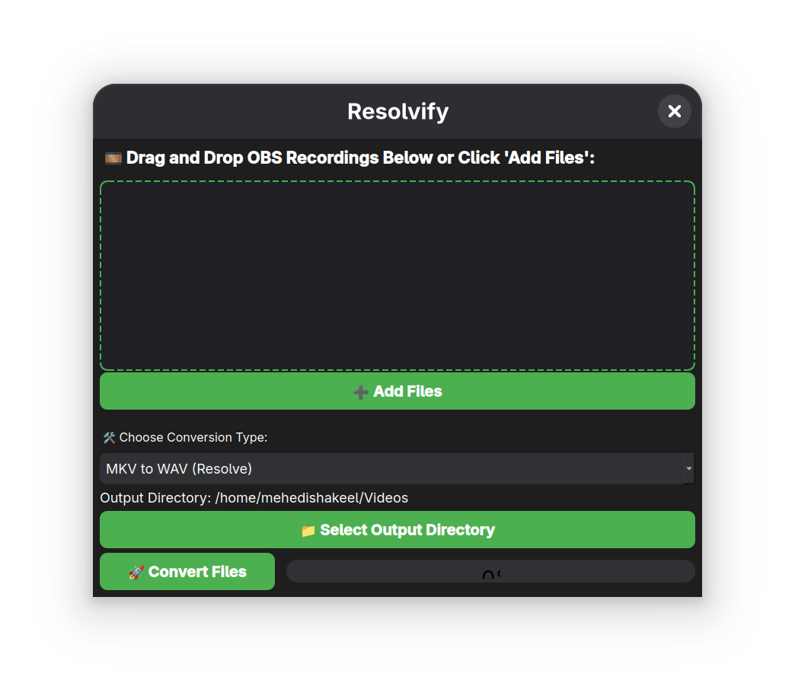

# 🎧 Resolvify

**Resolvify** is a simple, modern, Linux-only GUI application built with PyQt5 that lets you convert OBS video/audio recordings using `ffmpeg`. Drag and drop your files, choose a conversion type, and click convert. Perfect for video editors who need quick conversions for DaVinci Resolve, YouTube, or podcast audio.

 <!-- Replace with actual image path -->

---

## 🚀 Features

- 🎞️ Drag & Drop files (MKV, MP4, WAV)
- 🔧 6 One-click conversion presets:
  - MKV to WAV (Resolve)
  - MP4 to WAV (Resolve)
  - MP4 to MOV (ProRes) (Resolve)
  - MKV to MP4 (H.264)
  - MP4 to MP3
  - WAV to MP3
- 📁 Output directory selector
- 📊 Progress bar with status
- 💻 Clean and modern dark UI
- 🐧 Linux-only (for now)

---

Install the following packages based on your Linux distribution:

## Requirements & Dependencies

- Linux (Ubuntu, Debian, Fedora, Arch, etc.)  
- Python 3.6 or higher  
- `ffmpeg` installed and accessible from terminal  
- PyQt5 Python package

## Usage
```bash
- git clone https://github.com/mehedishakeel/Resolvify.git
- cd Resolvify
- python Resolvify.py
```
## Contact
[](https://mehedishakeel.com)
[](https://youtube.com/sstectutorials)
[](https://youtube.com/mehedishakeel)
[](https://twitter.com/mehedishakeel)
[](http://instagram.com/mehedishakeel/)
<br>
Thank You!
